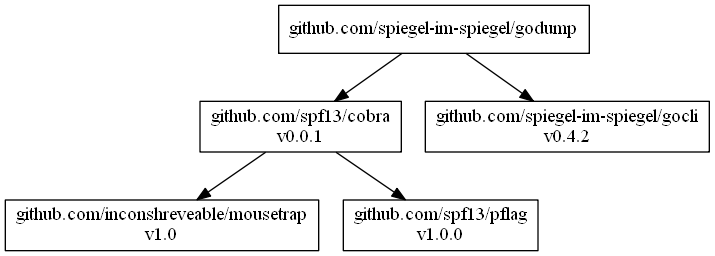

# [godump]

[](https://raw.githubusercontent.com/spiegel-im-spiegel/godump/master/LICENSE)

## Install

```
$ go get github.com/spiegel-im-spiegel/godump
```

Installing by [dep].

```
$ dep ensure -add github.com/spiegel-im-spiegel/godump
```

## Usage

```go
dump, err := godump.DumpBytes(bytes.NewBufferString("hello world"), "foobar")
if err != nil {
	return
}
io.Copy(os.Stdout, dump)
// Output:
// var foobar = []byte{0x68, 0x65, 0x6c, 0x6c, 0x6f, 0x20, 0x77, 0x6f, 0x72, 0x6c, 0x64}
```

## Command Line Interface

```
$ godump -h
Usage:
  godump [flags] [binary file]

Flags:
  -h, --help          help for godump
  -n, --name string   value name (default "dumpList")
```

```
$ echo hello world | godump -n foobar
var foobar = []byte{0x68, 0x65, 0x6c, 0x6c, 0x6f, 0x20, 0x77, 0x6f, 0x72, 0x6c, 0x64, 0x0a}
```

```
$ cat input.txt
hello world

$ godump -n foobar input.txt
var foobar = []byte{0x68, 0x65, 0x6c, 0x6c, 0x6f, 0x20, 0x77, 0x6f, 0x72, 0x6c, 0x64}
```

### Dependencies (CLI only)

```
dep status -dot | dot -Tpng -o dependency.png
```

[](dependency.png)

[godump]: https://github.com/spiegel-im-spiegel/godump
[dep]: https://github.com/golang/dep "golang/dep: Go dependency management tool"
